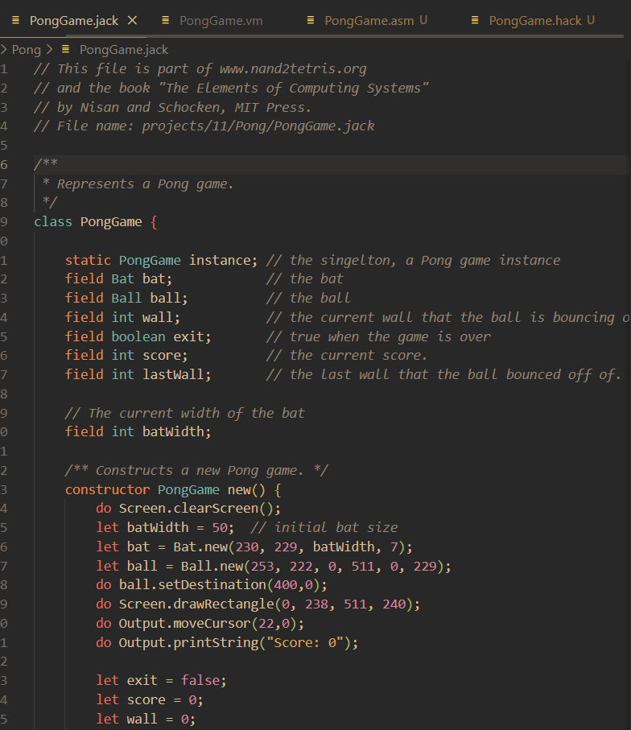
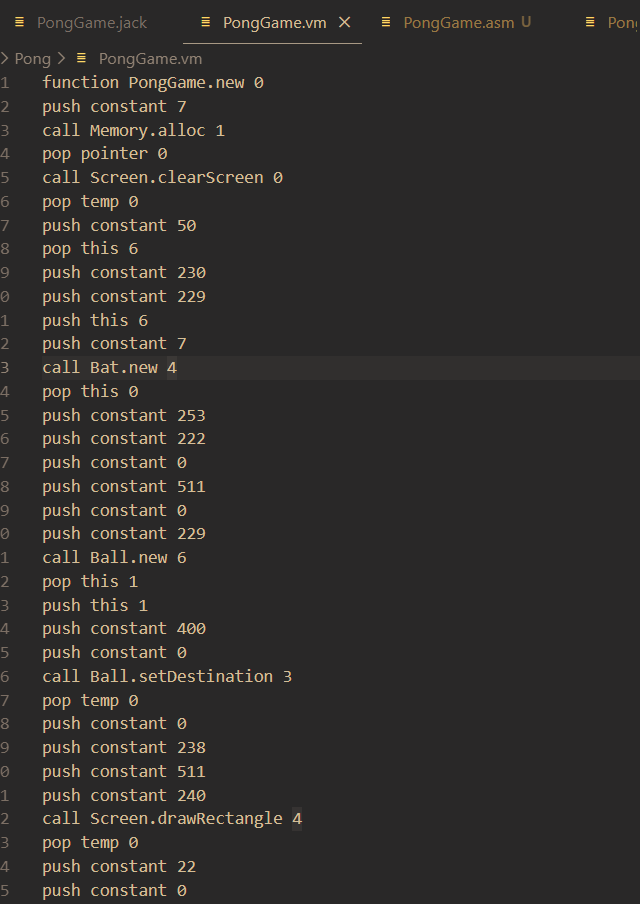
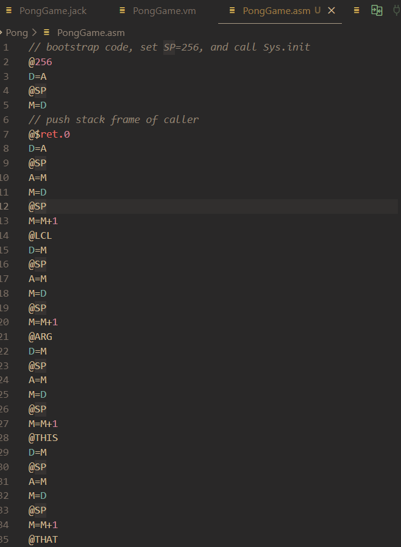
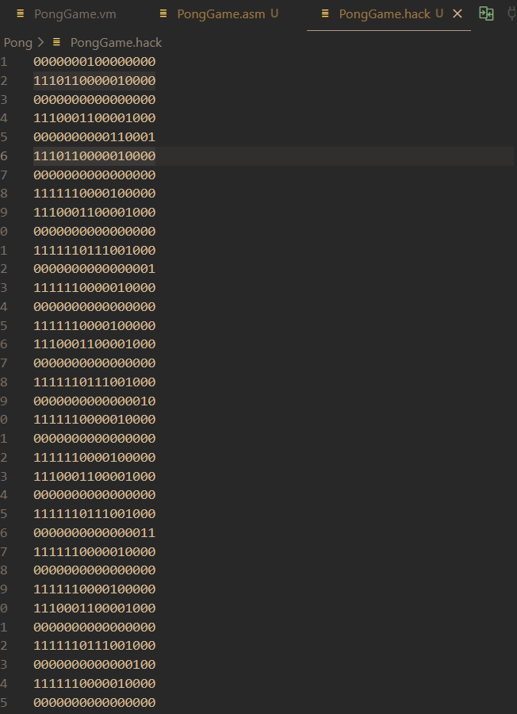

# NandToTetris
This repository is a collection of my implementations of the projects in 'THE ELEMENTS OF COMPUTING SYSTEMS', written by Noam Nisan and Shimon Schocken.

The book has two parts: Hardware and Software. I've completed the hardware section, and I am currently going through the software section. The hardware section starts with basic sequential and combinational logic chips and builds up to intermediaries such as Registers, Increamenters, Multiplexers, culminating into a custom build 'Hack' CPU, that is part of the final Hardware platform. The full hardware platform consists of the CPU, RAM and ROM. The instruction set is also formulated and I wrote simple programs in assembly using this instruction set, as well as an assembler for these instructions. I built the hardware using Hardware Description Language

The software section follows in the same spirit, starting from implementing a virtual machine, high level 'Jack' language, a compiler for this language, and finally, an Operating System. 

Computation
____________

The ALU uses 6 of the 16 bits of a compute instruction to decide which computation to perform

These 6 bits are ordered as zx, nx, zy, ny, f, no

 - if zx == 1 then x = 0
 - if nx == 1 then x = !x 
 - if zy == 1 then y = 0
 - if ny == 1 then y = !y 
 - if f == 1 then out = x + y else out = x and y
 - if no == 1 then out = !out 
 
 all negations use two's complement
 
 

 Instruction set
 _______________
 
 There are 2 types of instructions, an assignment (A) instruction and a compute (C) instruction
 

The RAM
_______

  A demultiplexer is used to select the appropiate area in RAM using the address passed. 
  
  
  

The ROM 
_______
  
A 32K register ROM for instructions
  

Computer Architecture
_____________________

The figure illustrates the hardware platform built. 
- The ROM-32K, contains 32,768 16-bit registers, each designed to store a 16-bit instruction. This ROM is pre-loaded with the instructions that need to be exected. 
- The Memory is a RAM as seen above
- The CPU fetches, decodes and executes instructions:

  FDE CYCLE
  ________
  * An instruction comes into the CPU from the ROM-32K. The instruction will have been addressed by the program counter, starting at ROM[0]. 
  * The instruction set above shows that we can tell whether the instruction is a Compute or Assignment instruction using the most significant bit.
  * If it is an assignment instruction (@xxx), the 16 bits are loaded into the CPU's A-register. This data could be used for direct or immediate addressing;
      direct addressing would mean that the data needed is in RAM[A], while immediate addressing would mean that the data needed is in the A register. 
  * If it is a compute instruction, the 16 bits are taken to be micro-codes that are decoded and used to control parts of the CPU needed to execute the instruction, with data from a previous cycle.
- The output outM of the CPU is a 16-bit value that will be stored in RAM. The memory address is at addressM, and the load bit for the RAM is writeM. 
- The program counter outputs the address of the next instruction based on whether a jump should be enacted (address to jump to will be stored in the A register), or the next instriction should be loaded. 

  The CPU
  _______
  
  

  Decides what to compute based on incoming machine code instruction.

Software:
_________

The pipeline is as follows:

Example output from my software:

 -> 
 ->
 ->

Virtual Machine
_______________

The compiler built follows a 2-tier compilation model like Java, Python and some C++ compilers. First, high level Jack code is compiled into a virtual machine language, then a Virtual Machine translator converts the VM code into assembly code. 

The idea that all high level commands can be re-written as stack operations motivates the use of a stack as the data structure around which the VM is based. The VM implements arithmetic, comparison, function calls and returns all using stack based commands. There are 8 virtual memory segments which representing some high level construct. These are mapped onto different segments on the RAM.

  Virtual memory segments:
  ________________________
  * *argument* -> represents function's arguments
  * *local* -> represents function's local variables 
  * *static* -> represents class level static variables (shared by all instances of class)
  * *constant* -> constant values 0-32767
  * *this* -> a field in an instance of some class
  * *that* -> an element in an Array instace
  * *pointer* -> base address of an object
  * *temp* -> temporary storage registers

  Memory mapping of usable memory:
  _______________________________
  
  - 0-15 -> 16 virtual registers
  - 16-255 -> static variables
  - 256-2047 -> stack

  Virtual registers usage:
  ________________________
  - SP (stack pointer) - RAM[0]
  - LCL (base address of *local* segment) - RAM[1]
  - ARG (base address of *argument* segment) - RAM[2]
  - THIS (base address of the *this* segment) - RAM[3]
  - THAT (base address of the *that* segment) - RAM[4]
  - TEMP (the *temp* segment) - RAM[5-12]
  - R13, R14, R15 (assembly code generated by VM translator can use these registers)

The VM handles all function call and return overhead such as saving and loading stack frames correctly. 

Compiler
________

Since we are using a 2-tier compilation model, the VM translator which converts VM code into assembly is the compiler's back-end. We need to write code that converts high level code into VM code. The first step is lexing the program, which means reducing the program into its tokens. These tokens can then be parsed to understand the program's semantics by comparing the sequence of tokens to the grammar of the language. Once this is done, we can produce VM code that realises these semantics.

